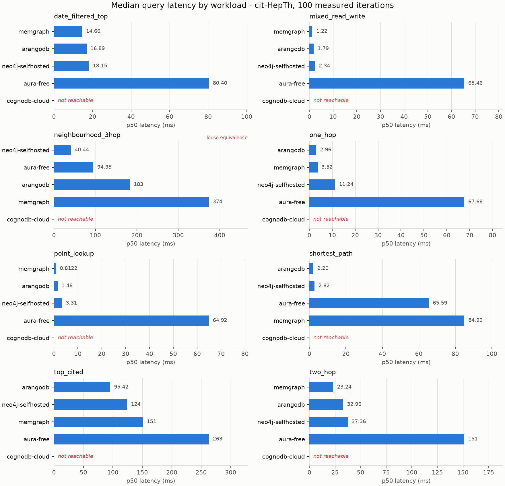
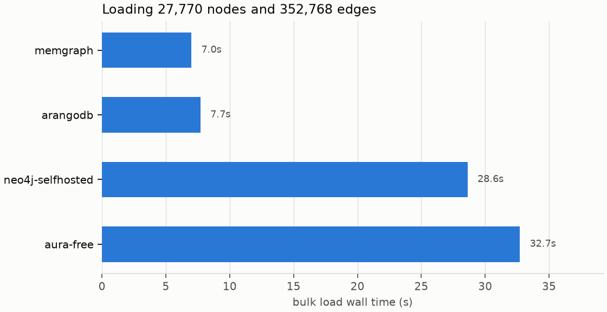

# Benchmark report - merged-20260828T103536Z

Generated from `results/raw/merged-20260828T103536Z.json`. Every number below can be recomputed from that file with `scripts/make_report.py`.

## Coverage

| target           | date_filtered_top   | ingest        | mixed_read_write   | neighbourhood_3hop   | one_hop       | point_lookup   | shortest_path   | top_cited     | two_hop       |
|------------------|---------------------|---------------|--------------------|----------------------|---------------|----------------|-----------------|---------------|---------------|
| arangodb         | ok                  | ok            | ok                 | ok                   | ok            | ok             | ok              | ok            | ok            |
| aura-free        | ok                  | ok            | ok                 | ok                   | ok            | ok             | ok              | ok            | ok            |
| cognodb-cloud    | not reachable       | not reachable | not reachable      | not reachable        | not reachable | not reachable  | not reachable   | not reachable | not reachable |
| memgraph         | ok                  | ok            | ok                 | ok                   | ok            | ok             | ok              | ok            | ok            |
| neo4j-selfhosted | ok                  | ok            | ok                 | ok                   | ok            | ok             | ok              | ok            | ok            |

## Charts

## Results

### date_filtered_top

Most-cited papers published within a given year.

| target           | n   | p50 ms   | p95 ms   | p99 ms   | vs baseline      | rows   | status                                                                 |
|------------------|-----|----------|----------|----------|------------------|--------|------------------------------------------------------------------------|
| arangodb         | 100 | 16.89    | 29.91    | 35.18    | 0.93x            | 25     | ok                                                                     |
| aura-free        | 100 | 80.40    | 90.76    | 96.02    | 4.43x            | 25     | ok                                                                     |
| cognodb-cloud    | -   | -        | -        | -        | -                | -      | not reachable - cognodb-cloud: could not connect to bolt+s://<cognodb-endpoint-redacted> |
| memgraph         | 100 | 14.60    | 25.83    | 33.33    | 0.80x            | 25     | ok                                                                     |
| neo4j-selfhosted | 100 | 18.15    | 89.35    | 109.68   | 1.00x (baseline) | 25     | ok                                                                     |

### mixed_read_write

Read-heavy mix: one-hop expansion with interleaved counter updates.

| target           | n   | p50 ms   | p95 ms   | p99 ms   | vs baseline      | rows   | status                                                                 |
|------------------|-----|----------|----------|----------|------------------|--------|------------------------------------------------------------------------|
| arangodb         | 100 | 1.79     | 2.91     | 3.34     | 0.76x            | 1      | ok                                                                     |
| aura-free        | 100 | 65.46    | 70.46    | 94.01    | 27.98x           | 1      | ok                                                                     |
| cognodb-cloud    | -   | -        | -        | -        | -                | -      | not reachable - cognodb-cloud: could not connect to bolt+s://<cognodb-endpoint-redacted> |
| memgraph         | 100 | 1.22     | 2.39     | 4.03     | 0.52x            | 1      | ok                                                                     |
| neo4j-selfhosted | 100 | 2.34     | 6.81     | 10.34    | 1.00x (baseline) | 1      | ok                                                                     |

### neighbourhood_3hop

Size of the undirected three-hop neighbourhood of a paper.

| target           | n   | p50 ms   | p95 ms   | p99 ms   | vs baseline      | rows   | status                                                                 |
|------------------|-----|----------|----------|----------|------------------|--------|------------------------------------------------------------------------|
| arangodb         | 100 | 183.04   | 296.93   | 355.17   | 4.53x            | 1      | ok                                                                     |
| aura-free        | 100 | 94.95    | 110.21   | 134.48   | 2.35x            | 1      | ok                                                                     |
| cognodb-cloud    | -   | -        | -        | -        | -                | -      | not reachable - cognodb-cloud: could not connect to bolt+s://<cognodb-endpoint-redacted> |
| memgraph         | 100 | 374.00   | 843.12   | 1090.90  | 9.25x            | 1      | ok                                                                     |
| neo4j-selfhosted | 100 | 40.44    | 103.48   | 242.78   | 1.00x (baseline) | 1      | ok                                                                     |

> Equivalence: loose. The two engines are asked for the same number and allowed to reach it differently. Cypher enumerates paths and deduplicates with count(DISTINCT ...); AQL uses uniqueVertices:'global', which prunes during the walk. That is a genuine difference in work done, so this row compares engine-plus-optimiser rather than raw traversal speed, and it is the one workload here whose ratio should not be quoted on its own.

### one_hop

Papers directly cited by a given paper.

| target           | n   | p50 ms   | p95 ms   | p99 ms   | vs baseline      | rows   | status                                                                 |
|------------------|-----|----------|----------|----------|------------------|--------|------------------------------------------------------------------------|
| arangodb         | 100 | 2.96     | 7.03     | 7.68     | 0.26x            | 93     | ok                                                                     |
| aura-free        | 100 | 67.68    | 70.79    | 73.79    | 6.02x            | 93     | ok                                                                     |
| cognodb-cloud    | -   | -        | -        | -        | -                | -      | not reachable - cognodb-cloud: could not connect to bolt+s://<cognodb-endpoint-redacted> |
| memgraph         | 100 | 3.52     | 6.11     | 6.64     | 0.31x            | 93     | ok                                                                     |
| neo4j-selfhosted | 100 | 11.24    | 40.13    | 47.06    | 1.00x (baseline) | 93     | ok                                                                     |

### point_lookup

Fetch a single paper by id.

| target           | n   | p50 ms   | p95 ms   | p99 ms   | vs baseline      | rows   | status                                                                 |
|------------------|-----|----------|----------|----------|------------------|--------|------------------------------------------------------------------------|
| arangodb         | 100 | 1.48     | 2.38     | 3.82     | 0.45x            | 1      | ok                                                                     |
| aura-free        | 100 | 64.92    | 66.76    | 69.87    | 19.60x           | 1      | ok                                                                     |
| cognodb-cloud    | -   | -        | -        | -        | -                | -      | not reachable - cognodb-cloud: could not connect to bolt+s://<cognodb-endpoint-redacted> |
| memgraph         | 100 | 0.81     | 2.72     | 4.06     | 0.25x            | 1      | ok                                                                     |
| neo4j-selfhosted | 100 | 3.31     | 34.61    | 44.63    | 1.00x (baseline) | 1      | ok                                                                     |

### shortest_path

Hop count of the shortest undirected path between two papers.

| target           | n   | p50 ms   | p95 ms   | p99 ms   | vs baseline      | rows   | status                                                                 |
|------------------|-----|----------|----------|----------|------------------|--------|------------------------------------------------------------------------|
| arangodb         | 100 | 2.20     | 2.84     | 3.16     | 0.78x            | 1      | ok                                                                     |
| aura-free        | 100 | 65.59    | 66.94    | 73.35    | 23.26x           | 1      | ok                                                                     |
| cognodb-cloud    | -   | -        | -        | -        | -                | -      | not reachable - cognodb-cloud: could not connect to bolt+s://<cognodb-endpoint-redacted> |
| memgraph         | 100 | 84.99    | 111.66   | 141.73   | 30.13x           | 1      | ok                                                                     |
| neo4j-selfhosted | 100 | 2.82     | 8.89     | 37.26    | 1.00x (baseline) | 1      | ok                                                                     |

### top_cited

The most-cited papers in the corpus, by in-degree.

| target           | n   | p50 ms   | p95 ms   | p99 ms   | vs baseline      | rows   | status                                                                 |
|------------------|-----|----------|----------|----------|------------------|--------|------------------------------------------------------------------------|
| arangodb         | 100 | 95.42    | 129.65   | 210.76   | 0.77x            | 25     | ok                                                                     |
| aura-free        | 100 | 263.12   | 315.38   | 341.48   | 2.12x            | 25     | ok                                                                     |
| cognodb-cloud    | -   | -        | -        | -        | -                | -      | not reachable - cognodb-cloud: could not connect to bolt+s://<cognodb-endpoint-redacted> |
| memgraph         | 100 | 151.04   | 212.47   | 235.68   | 1.22x            | 25     | ok                                                                     |
| neo4j-selfhosted | 100 | 124.16   | 190.93   | 268.68   | 1.00x (baseline) | 25     | ok                                                                     |

### two_hop

Distinct papers exactly two citation hops downstream.

| target           | n   | p50 ms   | p95 ms   | p99 ms   | vs baseline      | rows   | status                                                                 |
|------------------|-----|----------|----------|----------|------------------|--------|------------------------------------------------------------------------|
| arangodb         | 100 | 32.96    | 60.91    | 75.60    | 0.88x            | 1312   | ok                                                                     |
| aura-free        | 100 | 151.35   | 184.61   | 246.56   | 4.05x            | 1312   | ok                                                                     |
| cognodb-cloud    | -   | -        | -        | -        | -                | -      | not reachable - cognodb-cloud: could not connect to bolt+s://<cognodb-endpoint-redacted> |
| memgraph         | 100 | 23.24    | 54.88    | 63.18    | 0.62x            | 1312   | ok                                                                     |
| neo4j-selfhosted | 100 | 37.36    | 82.35    | 97.49    | 1.00x (baseline) | 1312   | ok                                                                     |

## Concurrency scaling

### mixed_read_write - concurrency scaling

Cells are `p50 ms / p95 ms / requests per second`. Throughput is measured from the wall clock of the concurrent phase, not from 1/mean-latency, which would overstate it by roughly the client count.

| target           | c=1                | c=10                 | c=40                 |
|------------------|--------------------|----------------------|----------------------|
| arangodb         | 1.79 / 2.91 / 500  | 14.23 / 34.80 / 529  | 16.16 / 38.38 / 519  |
| aura-free        | 65.46 / 70.46 / 15 | 61.52 / 160.07 / 127 | 63.66 / 136.24 / 346 |
| cognodb-cloud    | not reachable      | not reachable        | not reachable        |
| memgraph         | 1.22 / 2.39 / 694  | 7.06 / 15.23 / 1,114 | 11.43 / 38.70 / 734  |
| neo4j-selfhosted | 2.34 / 6.81 / 192  | 14.43 / 33.04 / 578  | 22.55 / 90.56 / 439  |

### one_hop - concurrency scaling

Cells are `p50 ms / p95 ms / requests per second`. Throughput is measured from the wall clock of the concurrent phase, not from 1/mean-latency, which would overstate it by roughly the client count.

| target           | c=1                | c=10                 | c=40                  |
|------------------|--------------------|----------------------|-----------------------|
| arangodb         | 2.96 / 7.03 / 284  | 21.73 / 52.77 / 386  | 32.22 / 65.53 / 409   |
| aura-free        | 67.68 / 70.79 / 15 | 69.16 / 172.69 / 109 | 232.31 / 598.36 / 115 |
| cognodb-cloud    | not reachable      | not reachable        | not reachable         |
| memgraph         | 3.52 / 6.11 / 256  | 71.85 / 164.89 / 120 | 263.14 / 469.57 / 111 |
| neo4j-selfhosted | 11.24 / 40.13 / 66 | 76.91 / 169.27 / 108 | 330.04 / 796.88 / 84  |

### point_lookup - concurrency scaling

Cells are `p50 ms / p95 ms / requests per second`. Throughput is measured from the wall clock of the concurrent phase, not from 1/mean-latency, which would overstate it by roughly the client count.

| target           | c=1                | c=10                 | c=40                 |
|------------------|--------------------|----------------------|----------------------|
| arangodb         | 1.48 / 2.38 / 604  | 8.42 / 20.71 / 736   | 14.30 / 34.49 / 684  |
| aura-free        | 64.92 / 66.76 / 15 | 60.26 / 64.84 / 153  | 60.20 / 133.27 / 371 |
| cognodb-cloud    | not reachable      | not reachable        | not reachable        |
| memgraph         | 0.81 / 2.72 / 967  | 5.59 / 13.07 / 1,285 | 7.80 / 20.59 / 943   |
| neo4j-selfhosted | 3.31 / 34.61 / 161 | 26.97 / 57.56 / 312  | 85.31 / 154.25 / 358 |

## Bulk load

### ingest (bulk load)

Wall time for the batched load, the implied edge throughput, and the counts the server itself reported afterwards. A target whose counts did not match the dataset is marked failed: its read numbers would describe a smaller graph. `indexed` is the separately confirmed presence of the Paper(id) index - a `NO` there means that target was measured without the index every other target had, and its read rows are not comparable.

| target           | load s   | edges/s   | nodes / edges held   | indexed   | status                                                                                 |
|------------------|----------|-----------|----------------------|-----------|----------------------------------------------------------------------------------------|
| arangodb         | 7.7      | 45,820    | 27,770 / 352,768     | yes       | verified                                                                               |
| aura-free        | 32.7     | 10,785    | 27,770 / 352,768     | yes       | verified                                                                               |
| cognodb-cloud    | -        | -         | -                    | -         | not reachable - cognodb-cloud: could not connect to bolt+s://<cognodb-endpoint-redacted> |
| memgraph         | 7.0      | 50,452    | 27,770 / 352,768     | yes       | verified                                                                               |
| neo4j-selfhosted | 28.6     | 12,329    | 27,770 / 352,768     | yes       | verified                                                                               |

## Limitations

Generated from this run's own record, not written from memory.

**Not measured at all: cognodb-cloud.** These targets appear in every table as `not reachable`, which is different from and less flattering than being absent. Nothing about their performance is claimed or implied here.

**p99 not resolvable for arangodb, aura-free, memgraph, neo4j-selfhosted** at this sample size: nearest-rank p99 needs 100 observations before it is distinguishable from the maximum. Those cells are marked and should be read as the maximum.

**Loose equivalence: neighbourhood_3hop.** The engines are asked for the same answer but reach it by materially different means, so this row compares engine-plus-optimiser rather than raw traversal speed. Do not quote its ratio on its own.

**Structural limits that apply to every number here**, regardless of which targets ran:

- One client, one connection, at each stated concurrency level. This is a latency benchmark; it does not measure capacity.
- One dataset at one size. An engine that wins on 27,770 nodes may lose at a hundred times that, and nothing here predicts which.
- Read-heavy. Only the bulk load and the mixed workload write at all.
- Nothing about durability, replication, failover, backup or operability.
- A single run. Free-tier instances share hardware and drift; a gap smaller than the spread between repeat runs is not a finding.

## Conclusion

**Measured: arangodb, aura-free, memgraph, neo4j-selfhosted.**

**Directly comparable: arangodb, aura-free, memgraph, neo4j-selfhosted.** These ran the same workloads, with the same seeded parameters in the same order, under verified equivalent indexes, one target at a time so none contended with another. Differences between them are attributable to the engines and their configuration.

The honest summary of any single run of this kind is narrow: it says how these builds behaved on this dataset, at this size, under these caps, from this client, on this day. It does not establish that one engine is faster than another in general, and the raw per-iteration timings are committed alongside precisely so that anyone who disagrees with the statistics can compute their own from the same observations.

### Run conditions

- run id: `merged-20260828T103536Z`
- started: 2026-08-28T08:43:27+00:00, finished: 2026-08-28T10:42:21+00:00
- dataset: cit-HepTh (27,770 nodes, 352,768 edges)
- iterations: 100 measured after 5 warmup, seed 20260827
- client: Python 3.12.11 on Linux-6.8.0-1052-azure-x86_64-with-glibc2.36

† at this sample size the percentile equals the observed maximum.

### Consistency

all cross-checked workloads returned matching row counts on every target

### Notes

- merged from 4 run(s) measured sequentially, not simultaneously: 20260828T103536Z (2026-08-28T10:35:36+00:00), merged-20260828T103736Z-managed (2026-08-28T10:38:38+00:00), 20260828T084232Z-memgraph (2026-08-28T08:45:03+00:00), 20260828T084232Z-neo4j-selfhosted (2026-08-28T08:43:27+00:00)
- cognodb-cloud skipped (disabled in configuration)
- aura-free skipped (disabled in configuration)
- neo4j-selfhosted skipped (disabled in configuration)
- memgraph skipped (disabled in configuration)
- falkordb skipped (disabled in configuration)
- arangodb server version: ArangoDB 3.12.10-1
- merged from 1 run(s) measured sequentially, not simultaneously: 20260828T103736Z-managed (2026-08-28T10:38:38+00:00)
- neo4j-selfhosted skipped (disabled in configuration)
- memgraph skipped (disabled in configuration)
- falkordb skipped (disabled in configuration)
- arangodb skipped (disabled in configuration)
- cognodb-cloud unavailable: cognodb-cloud: could not connect to bolt+s://<cognodb-endpoint-redacted>: {code: Neo.ClientError.Security.Unauthorized} {message: The client is unauthorized due to authentication failure.}
- aura-free server version: Neo4j Kernel 5.27-aura (enterprise)
- cognodb-cloud skipped (disabled in configuration)
- aura-free skipped (not configured: AURA_URI, AURA_PASSWORD unset)
- neo4j-selfhosted skipped (disabled in configuration)
- falkordb skipped (disabled in configuration)
- arangodb skipped (disabled in configuration)
- memgraph server version: 3.12.0
- cognodb-cloud skipped (disabled in configuration)
- aura-free skipped (not configured: AURA_URI, AURA_PASSWORD unset)
- memgraph skipped (disabled in configuration)
- falkordb skipped (disabled in configuration)
- arangodb skipped (disabled in configuration)
- neo4j-selfhosted server version: Neo4j Kernel 5.26.30 (community)
