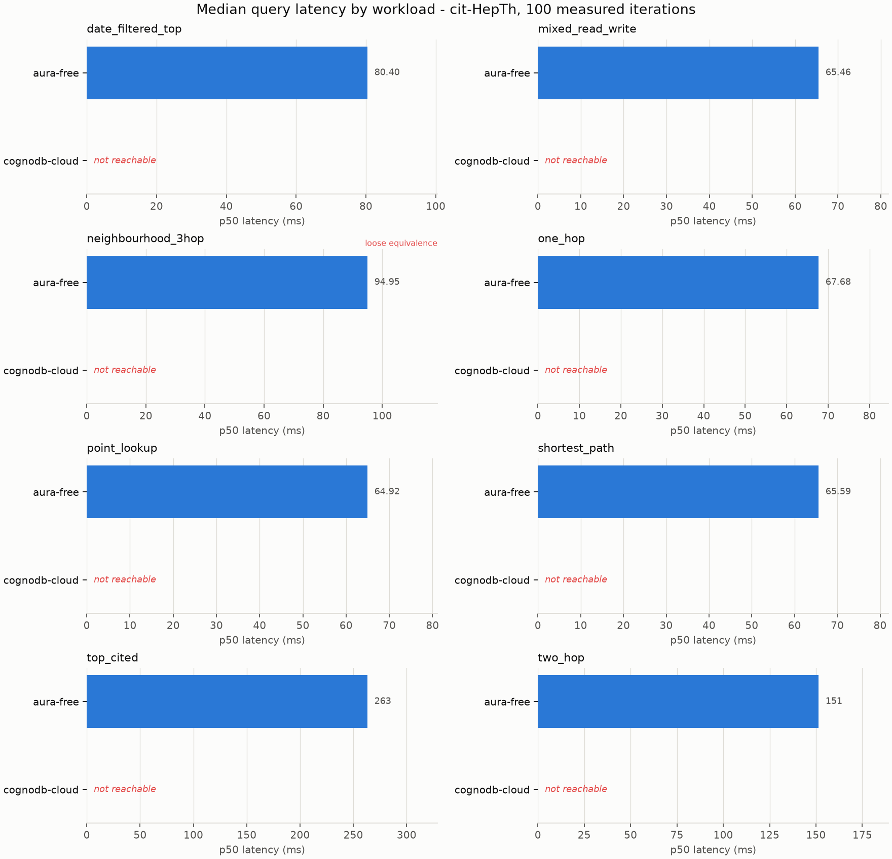
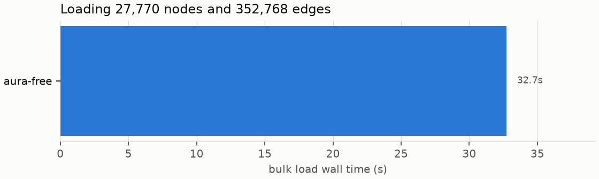

# Benchmark report - merged-20260828T103736Z-managed

Generated from `results/raw/merged-20260828T103736Z-managed.json`. Every number below can be recomputed from that file with `scripts/make_report.py`.

## Coverage

| target        | date_filtered_top   | ingest        | mixed_read_write   | neighbourhood_3hop   | one_hop       | point_lookup   | shortest_path   | top_cited     | two_hop       |
|---------------|---------------------|---------------|--------------------|----------------------|---------------|----------------|-----------------|---------------|---------------|
| aura-free     | ok                  | ok            | ok                 | ok                   | ok            | ok             | ok              | ok            | ok            |
| cognodb-cloud | not reachable       | not reachable | not reachable      | not reachable        | not reachable | not reachable  | not reachable   | not reachable | not reachable |

## Charts

## Results

### date_filtered_top

Most-cited papers published within a given year.

| target        | n   | p50 ms   | p95 ms   | p99 ms   | vs baseline      | rows   | status                                                                 |
|---------------|-----|----------|----------|----------|------------------|--------|------------------------------------------------------------------------|
| aura-free     | 100 | 80.40    | 90.76    | 96.02    | 1.00x (baseline) | 25     | ok                                                                     |
| cognodb-cloud | -   | -        | -        | -        | -                | -      | not reachable - cognodb-cloud: could not connect to bolt+s://<cognodb-endpoint-redacted> |

### mixed_read_write

Read-heavy mix: one-hop expansion with interleaved counter updates.

| target        | n   | p50 ms   | p95 ms   | p99 ms   | vs baseline      | rows   | status                                                                 |
|---------------|-----|----------|----------|----------|------------------|--------|------------------------------------------------------------------------|
| aura-free     | 100 | 65.46    | 70.46    | 94.01    | 1.00x (baseline) | 1      | ok                                                                     |
| cognodb-cloud | -   | -        | -        | -        | -                | -      | not reachable - cognodb-cloud: could not connect to bolt+s://<cognodb-endpoint-redacted> |

### neighbourhood_3hop

Size of the undirected three-hop neighbourhood of a paper.

| target        | n   | p50 ms   | p95 ms   | p99 ms   | vs baseline      | rows   | status                                                                 |
|---------------|-----|----------|----------|----------|------------------|--------|------------------------------------------------------------------------|
| aura-free     | 100 | 94.95    | 110.21   | 134.48   | 1.00x (baseline) | 1      | ok                                                                     |
| cognodb-cloud | -   | -        | -        | -        | -                | -      | not reachable - cognodb-cloud: could not connect to bolt+s://<cognodb-endpoint-redacted> |

> Equivalence: loose. The two engines are asked for the same number and allowed to reach it differently. Cypher enumerates paths and deduplicates with count(DISTINCT ...); AQL uses uniqueVertices:'global', which prunes during the walk. That is a genuine difference in work done, so this row compares engine-plus-optimiser rather than raw traversal speed, and it is the one workload here whose ratio should not be quoted on its own.

### one_hop

Papers directly cited by a given paper.

| target        | n   | p50 ms   | p95 ms   | p99 ms   | vs baseline      | rows   | status                                                                 |
|---------------|-----|----------|----------|----------|------------------|--------|------------------------------------------------------------------------|
| aura-free     | 100 | 67.68    | 70.79    | 73.79    | 1.00x (baseline) | 93     | ok                                                                     |
| cognodb-cloud | -   | -        | -        | -        | -                | -      | not reachable - cognodb-cloud: could not connect to bolt+s://<cognodb-endpoint-redacted> |

### point_lookup

Fetch a single paper by id.

| target        | n   | p50 ms   | p95 ms   | p99 ms   | vs baseline      | rows   | status                                                                 |
|---------------|-----|----------|----------|----------|------------------|--------|------------------------------------------------------------------------|
| aura-free     | 100 | 64.92    | 66.76    | 69.87    | 1.00x (baseline) | 1      | ok                                                                     |
| cognodb-cloud | -   | -        | -        | -        | -                | -      | not reachable - cognodb-cloud: could not connect to bolt+s://<cognodb-endpoint-redacted> |

### shortest_path

Hop count of the shortest undirected path between two papers.

| target        | n   | p50 ms   | p95 ms   | p99 ms   | vs baseline      | rows   | status                                                                 |
|---------------|-----|----------|----------|----------|------------------|--------|------------------------------------------------------------------------|
| aura-free     | 100 | 65.59    | 66.94    | 73.35    | 1.00x (baseline) | 1      | ok                                                                     |
| cognodb-cloud | -   | -        | -        | -        | -                | -      | not reachable - cognodb-cloud: could not connect to bolt+s://<cognodb-endpoint-redacted> |

### top_cited

The most-cited papers in the corpus, by in-degree.

| target        | n   | p50 ms   | p95 ms   | p99 ms   | vs baseline      | rows   | status                                                                 |
|---------------|-----|----------|----------|----------|------------------|--------|------------------------------------------------------------------------|
| aura-free     | 100 | 263.12   | 315.38   | 341.48   | 1.00x (baseline) | 25     | ok                                                                     |
| cognodb-cloud | -   | -        | -        | -        | -                | -      | not reachable - cognodb-cloud: could not connect to bolt+s://<cognodb-endpoint-redacted> |

### two_hop

Distinct papers exactly two citation hops downstream.

| target        | n   | p50 ms   | p95 ms   | p99 ms   | vs baseline      | rows   | status                                                                 |
|---------------|-----|----------|----------|----------|------------------|--------|------------------------------------------------------------------------|
| aura-free     | 100 | 151.35   | 184.61   | 246.56   | 1.00x (baseline) | 1312   | ok                                                                     |
| cognodb-cloud | -   | -        | -        | -        | -                | -      | not reachable - cognodb-cloud: could not connect to bolt+s://<cognodb-endpoint-redacted> |

## Concurrency scaling

### mixed_read_write - concurrency scaling

Cells are `p50 ms / p95 ms / requests per second`. Throughput is measured from the wall clock of the concurrent phase, not from 1/mean-latency, which would overstate it by roughly the client count.

| target        | c=1                | c=10                 | c=40                 |
|---------------|--------------------|----------------------|----------------------|
| aura-free     | 65.46 / 70.46 / 15 | 61.52 / 160.07 / 127 | 63.66 / 136.24 / 346 |
| cognodb-cloud | not reachable      | not reachable        | not reachable        |

### one_hop - concurrency scaling

Cells are `p50 ms / p95 ms / requests per second`. Throughput is measured from the wall clock of the concurrent phase, not from 1/mean-latency, which would overstate it by roughly the client count.

| target        | c=1                | c=10                 | c=40                  |
|---------------|--------------------|----------------------|-----------------------|
| aura-free     | 67.68 / 70.79 / 15 | 69.16 / 172.69 / 109 | 232.31 / 598.36 / 115 |
| cognodb-cloud | not reachable      | not reachable        | not reachable         |

### point_lookup - concurrency scaling

Cells are `p50 ms / p95 ms / requests per second`. Throughput is measured from the wall clock of the concurrent phase, not from 1/mean-latency, which would overstate it by roughly the client count.

| target        | c=1                | c=10                | c=40                 |
|---------------|--------------------|---------------------|----------------------|
| aura-free     | 64.92 / 66.76 / 15 | 60.26 / 64.84 / 153 | 60.20 / 133.27 / 371 |
| cognodb-cloud | not reachable      | not reachable       | not reachable        |

## Bulk load

### ingest (bulk load)

Wall time for the batched load, the implied edge throughput, and the counts the server itself reported afterwards. A target whose counts did not match the dataset is marked failed: its read numbers would describe a smaller graph. `indexed` is the separately confirmed presence of the Paper(id) index - a `NO` there means that target was measured without the index every other target had, and its read rows are not comparable.

| target        | load s   | edges/s   | nodes / edges held   | indexed   | status                                                                                 |
|---------------|----------|-----------|----------------------|-----------|----------------------------------------------------------------------------------------|
| aura-free     | 32.7     | 10,785    | 27,770 / 352,768     | yes       | verified                                                                               |
| cognodb-cloud | -        | -         | -                    | -         | not reachable - cognodb-cloud: could not connect to bolt+s://<cognodb-endpoint-redacted> |

### Run conditions

- run id: `merged-20260828T103736Z-managed`
- started: 2026-08-28T10:38:38+00:00, finished: 2026-08-28T10:42:21+00:00
- dataset: cit-HepTh (27,770 nodes, 352,768 edges)
- iterations: 100 measured after 5 warmup, seed 20260827
- client: Python 3.12.11 on Linux-6.8.0-1052-azure-x86_64-with-glibc2.36

† at this sample size the percentile equals the observed maximum.

### Consistency

only one target produced results, so no cross-engine check was possible

### Notes

- merged from 1 run(s) measured sequentially, not simultaneously: 20260828T103736Z-managed (2026-08-28T10:38:38+00:00)
- neo4j-selfhosted skipped (disabled in configuration)
- memgraph skipped (disabled in configuration)
- falkordb skipped (disabled in configuration)
- arangodb skipped (disabled in configuration)
- cognodb-cloud unavailable: cognodb-cloud: could not connect to bolt+s://<cognodb-endpoint-redacted>: {code: Neo.ClientError.Security.Unauthorized} {message: The client is unauthorized due to authentication failure.}
- aura-free server version: Neo4j Kernel 5.27-aura (enterprise)
