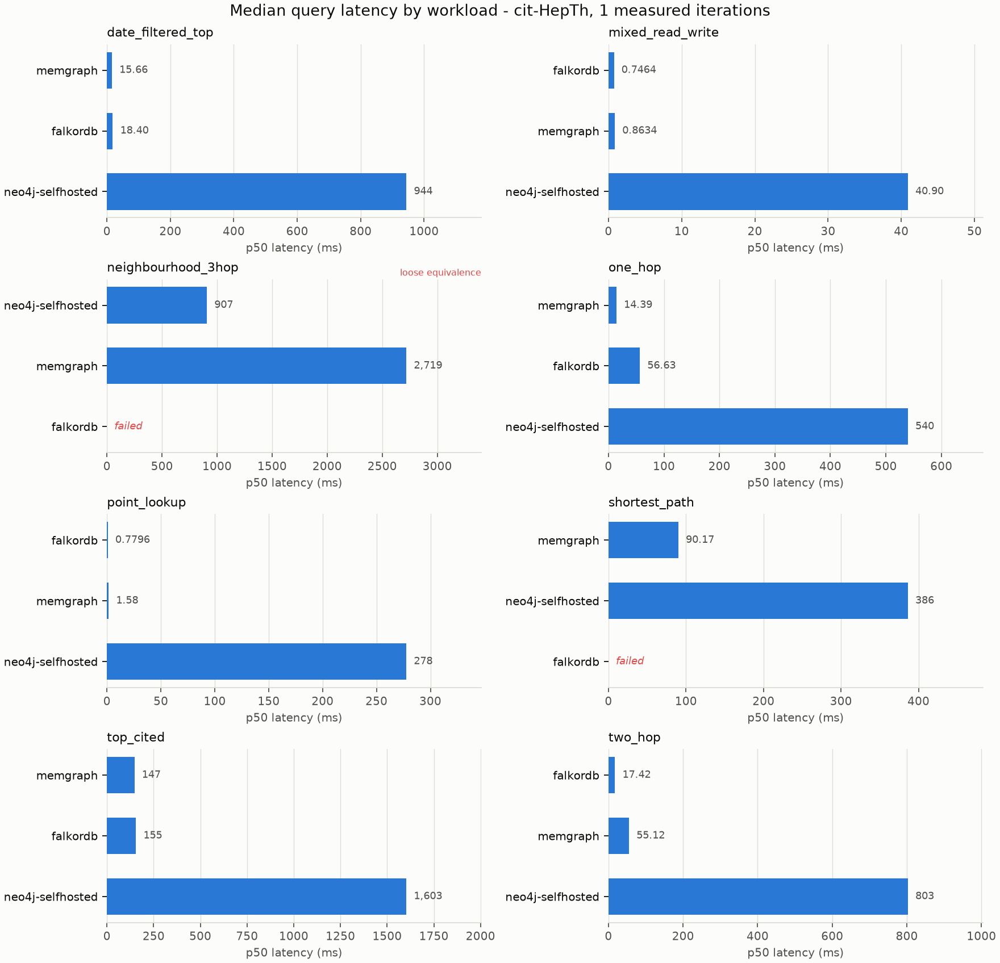
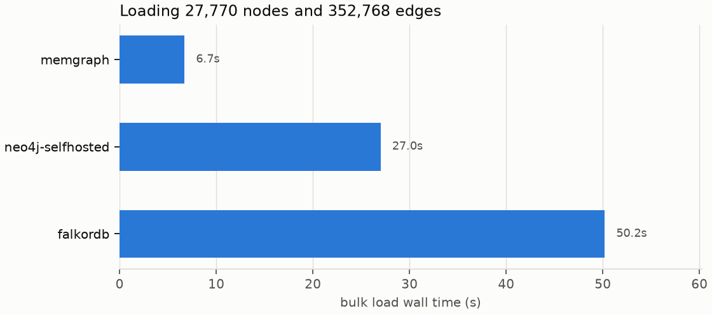

# Benchmark report - merged-smoke-20260827T181837Z-neo4j-selfhosted

Generated from `results/raw/merged-smoke-20260827T181837Z-neo4j-selfhosted.json`. Every number below can be recomputed from that file with `scripts/make_report.py`.

## Coverage

| target           | date_filtered_top   | ingest   | mixed_read_write   | neighbourhood_3hop   | one_hop   | point_lookup   | shortest_path   | top_cited   | two_hop   |
|------------------|---------------------|----------|--------------------|----------------------|-----------|----------------|-----------------|-------------|-----------|
| falkordb         | ok                  | ok       | ok                 | failed               | ok        | ok             | failed          | ok          | ok        |
| memgraph         | ok                  | ok       | ok                 | ok                   | ok        | ok             | ok              | ok          | ok        |
| neo4j-selfhosted | ok                  | ok       | ok                 | ok                   | ok        | ok             | ok              | ok          | ok        |

## Charts

## Results

### date_filtered_top

Most-cited papers published within a given year.

| target           | n   | p50 ms   | p95 ms   | p99 ms   | vs baseline      | rows   | status   |
|------------------|-----|----------|----------|----------|------------------|--------|----------|
| falkordb         | 1   | 18.40    | 18.40†   | 18.40†   | 0.02x            | 25     | ok       |
| memgraph         | 1   | 15.66    | 15.66†   | 15.66†   | 0.02x            | 25     | ok       |
| neo4j-selfhosted | 1   | 944.19   | 944.19†  | 944.19†  | 1.00x (baseline) | 25     | ok       |

### mixed_read_write

Read-heavy mix: one-hop expansion with interleaved counter updates.

| target           | n   | p50 ms   | p95 ms   | p99 ms   | vs baseline      | rows   | status   |
|------------------|-----|----------|----------|----------|------------------|--------|----------|
| falkordb         | 1   | 0.75     | 0.75†    | 0.75†    | 0.02x            | 1      | ok       |
| memgraph         | 1   | 0.86     | 0.86†    | 0.86†    | 0.02x            | 1      | ok       |
| neo4j-selfhosted | 1   | 40.90    | 40.90†   | 40.90†   | 1.00x (baseline) | 1      | ok       |

### neighbourhood_3hop

Size of the undirected three-hop neighbourhood of a paper.

| target           | n   | p50 ms   | p95 ms   | p99 ms   | vs baseline      | rows   | status                                                                 |
|------------------|-----|----------|----------|----------|------------------|--------|------------------------------------------------------------------------|
| falkordb         | -   | -        | -        | -        | -                | -      | failed - every measured iteration failed; last error: falkordb: Respon |
| memgraph         | 1   | 2719.16  | 2719.16† | 2719.16† | 3.00x            | 1      | ok                                                                     |
| neo4j-selfhosted | 1   | 907.38   | 907.38†  | 907.38†  | 1.00x (baseline) | 1      | ok                                                                     |

> Equivalence: loose. The two engines are asked for the same number and allowed to reach it differently. Cypher enumerates paths and deduplicates with count(DISTINCT ...); AQL uses uniqueVertices:'global', which prunes during the walk. That is a genuine difference in work done, so this row compares engine-plus-optimiser rather than raw traversal speed, and it is the one workload here whose ratio should not be quoted on its own.

### one_hop

Papers directly cited by a given paper.

| target           | n   | p50 ms   | p95 ms   | p99 ms   | vs baseline      | rows   | status   |
|------------------|-----|----------|----------|----------|------------------|--------|----------|
| falkordb         | 1   | 56.63    | 56.63†   | 56.63†   | 0.10x            | 562    | ok       |
| memgraph         | 1   | 14.39    | 14.39†   | 14.39†   | 0.03x            | 562    | ok       |
| neo4j-selfhosted | 1   | 539.73   | 539.73†  | 539.73†  | 1.00x (baseline) | 562    | ok       |

### point_lookup

Fetch a single paper by id.

| target           | n   | p50 ms   | p95 ms   | p99 ms   | vs baseline      | rows   | status   |
|------------------|-----|----------|----------|----------|------------------|--------|----------|
| falkordb         | 1   | 0.78     | 0.78†    | 0.78†    | 0.00x            | 1      | ok       |
| memgraph         | 1   | 1.58     | 1.58†    | 1.58†    | 0.01x            | 1      | ok       |
| neo4j-selfhosted | 1   | 277.71   | 277.71†  | 277.71†  | 1.00x (baseline) | 1      | ok       |

### shortest_path

Hop count of the shortest undirected path between two papers.

| target           | n   | p50 ms   | p95 ms   | p99 ms   | vs baseline      | rows   | status                                                                 |
|------------------|-----|----------|----------|----------|------------------|--------|------------------------------------------------------------------------|
| falkordb         | -   | -        | -        | -        | -                | -      | failed - every measured iteration failed; last error: falkordb: Respon |
| memgraph         | 1   | 90.17    | 90.17†   | 90.17†   | 0.23x            | 1      | ok                                                                     |
| neo4j-selfhosted | 1   | 386.28   | 386.28†  | 386.28†  | 1.00x (baseline) | 1      | ok                                                                     |

### top_cited

The most-cited papers in the corpus, by in-degree.

| target           | n   | p50 ms   | p95 ms   | p99 ms   | vs baseline      | rows   | status   |
|------------------|-----|----------|----------|----------|------------------|--------|----------|
| falkordb         | 1   | 155.40   | 155.40†  | 155.40†  | 0.10x            | 25     | ok       |
| memgraph         | 1   | 147.14   | 147.14†  | 147.14†  | 0.09x            | 25     | ok       |
| neo4j-selfhosted | 1   | 1602.97  | 1602.97† | 1602.97† | 1.00x (baseline) | 25     | ok       |

### two_hop

Distinct papers exactly two citation hops downstream.

| target           | n   | p50 ms   | p95 ms   | p99 ms   | vs baseline      | rows   | status   |
|------------------|-----|----------|----------|----------|------------------|--------|----------|
| falkordb         | 1   | 17.42    | 17.42†   | 17.42†   | 0.02x            | 2334   | ok       |
| memgraph         | 1   | 55.12    | 55.12†   | 55.12†   | 0.07x            | 2334   | ok       |
| neo4j-selfhosted | 1   | 802.79   | 802.79†  | 802.79†  | 1.00x (baseline) | 2334   | ok       |

## Concurrency scaling

### mixed_read_write - concurrency scaling

Cells are `p50 ms / p95 ms / requests per second`. Throughput is measured from the wall clock of the concurrent phase, not from 1/mean-latency, which would overstate it by roughly the client count.

| target           | c=1                 | c=10              | c=40               |
|------------------|---------------------|-------------------|--------------------|
| falkordb         | 0.75 / 0.75 / 1,311 | 1.04 / 1.04 / 476 | 0.84 / 0.84 / 208  |
| memgraph         | 0.86 / 0.86 / 1,140 | 1.40 / 1.40 / 497 | 1.24 / 1.24 / 192  |
| neo4j-selfhosted | 40.90 / 40.90 / 24  | 4.44 / 4.44 / 192 | 10.00 / 10.00 / 77 |

### one_hop - concurrency scaling

Cells are `p50 ms / p95 ms / requests per second`. Throughput is measured from the wall clock of the concurrent phase, not from 1/mean-latency, which would overstate it by roughly the client count.

| target           | c=1                 | c=10                | c=40               |
|------------------|---------------------|---------------------|--------------------|
| falkordb         | 56.63 / 56.63 / 18  | 3.23 / 3.23 / 228   | 51.17 / 51.17 / 18 |
| memgraph         | 14.39 / 14.39 / 69  | 26.12 / 26.12 / 37  | 15.91 / 15.91 / 57 |
| neo4j-selfhosted | 539.73 / 539.73 / 2 | 105.00 / 105.00 / 9 | 73.34 / 73.34 / 13 |

### point_lookup - concurrency scaling

Cells are `p50 ms / p95 ms / requests per second`. Throughput is measured from the wall clock of the concurrent phase, not from 1/mean-latency, which would overstate it by roughly the client count.

| target           | c=1                 | c=10              | c=40              |
|------------------|---------------------|-------------------|-------------------|
| falkordb         | 0.78 / 0.78 / 1,249 | 0.95 / 0.95 / 522 | 0.76 / 0.76 / 198 |
| memgraph         | 1.58 / 1.58 / 627   | 1.30 / 1.30 / 410 | 1.07 / 1.07 / 192 |
| neo4j-selfhosted | 277.71 / 277.71 / 4 | 7.09 / 7.09 / 117 | 8.59 / 8.59 / 93  |

## Bulk load

### ingest (bulk load)

Wall time for the batched load, the implied edge throughput, and the counts the server itself reported afterwards. A target whose counts did not match the dataset is marked failed: its read numbers would describe a smaller graph. `indexed` is the separately confirmed presence of the Paper(id) index - a `NO` there means that target was measured without the index every other target had, and its read rows are not comparable.

| target           | load s   | edges/s   | nodes / edges held   | indexed   | status   |
|------------------|----------|-----------|----------------------|-----------|----------|
| falkordb         | 50.2     | 7,030     | 27,770 / 352,768     | yes       | verified |
| memgraph         | 6.7      | 52,662    | 27,770 / 352,768     | yes       | verified |
| neo4j-selfhosted | 27.0     | 13,068    | 27,770 / 352,768     | yes       | verified |

### Run conditions

- run id: `merged-smoke-20260827T181837Z-neo4j-selfhosted`
- started: 2026-08-27T18:19:44+00:00, finished: 2026-08-27T18:22:59+00:00
- dataset: cit-HepTh (27,770 nodes, 352,768 edges)
- iterations: 1 measured after 0 warmup, seed 20260827
- client: Python 3.12.11 on Linux-6.8.0-1052-azure-x86_64-with-glibc2.36

† at this sample size the percentile equals the observed maximum.

### Consistency

all cross-checked workloads returned matching row counts on every target

### Notes

- merged from 3 run(s) measured sequentially, not simultaneously: smoke-20260827T181837Z-neo4j-selfhosted (2026-08-27T18:19:44+00:00), smoke-20260827T181837Z-memgraph (2026-08-27T18:21:14+00:00), smoke-20260827T181837Z-falkordb (2026-08-27T18:22:05+00:00)
- cognodb-cloud skipped (not configured: COGNODB_URI, COGNODB_PASSWORD unset)
- aura-free skipped (not configured: AURA_URI, AURA_PASSWORD unset)
- memgraph skipped (disabled in configuration)
- falkordb skipped (disabled in configuration)
- arangodb skipped (disabled in configuration)
- neo4j-selfhosted server version: Neo4j Kernel 5.26.30 (community)
- cognodb-cloud skipped (not configured: COGNODB_URI, COGNODB_PASSWORD unset)
- aura-free skipped (not configured: AURA_URI, AURA_PASSWORD unset)
- neo4j-selfhosted skipped (disabled in configuration)
- falkordb skipped (disabled in configuration)
- arangodb skipped (disabled in configuration)
- memgraph server version: 3.12.0
- cognodb-cloud skipped (not configured: COGNODB_URI, COGNODB_PASSWORD unset)
- aura-free skipped (not configured: AURA_URI, AURA_PASSWORD unset)
- neo4j-selfhosted skipped (disabled in configuration)
- memgraph skipped (disabled in configuration)
- arangodb skipped (disabled in configuration)
- falkordb server version: FalkorDB module graph v42004
